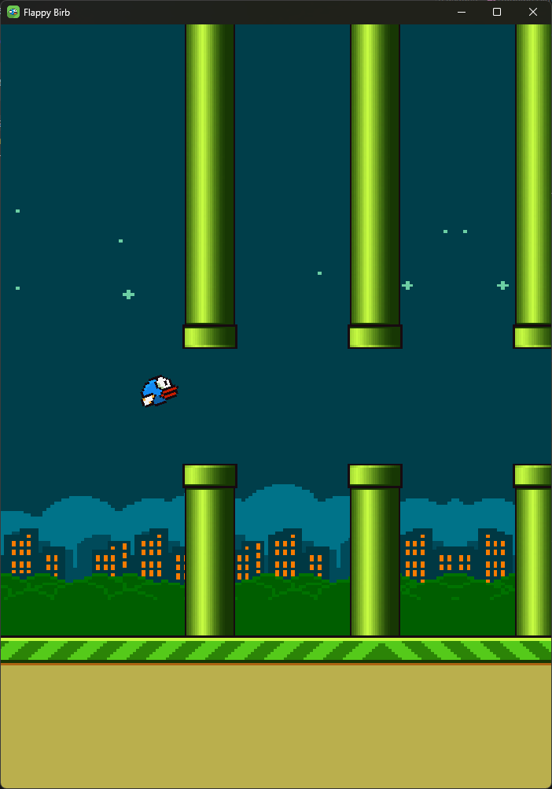

# Flappy Birb



Simple Flappy bird clone written using Glium.

To build and run the game:
```shell
cargo run --release
```

Use `Space` to play. The debug toolbox can be toggled on/off using the `F5` key
and can be used to change the parameters and colors of the bird and background.
